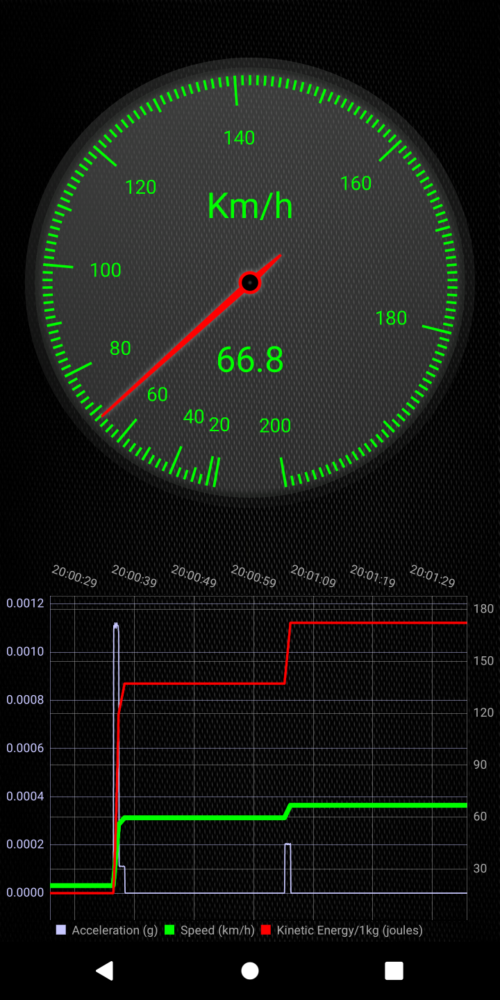
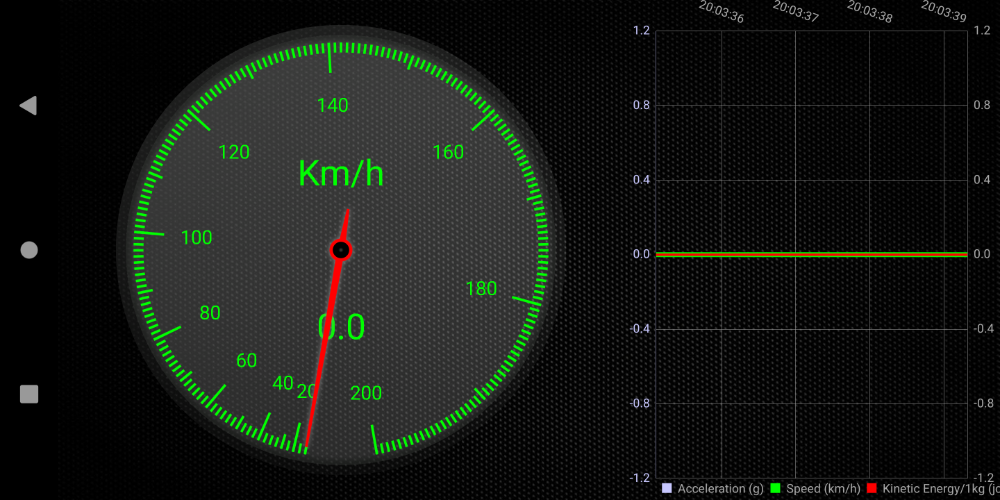
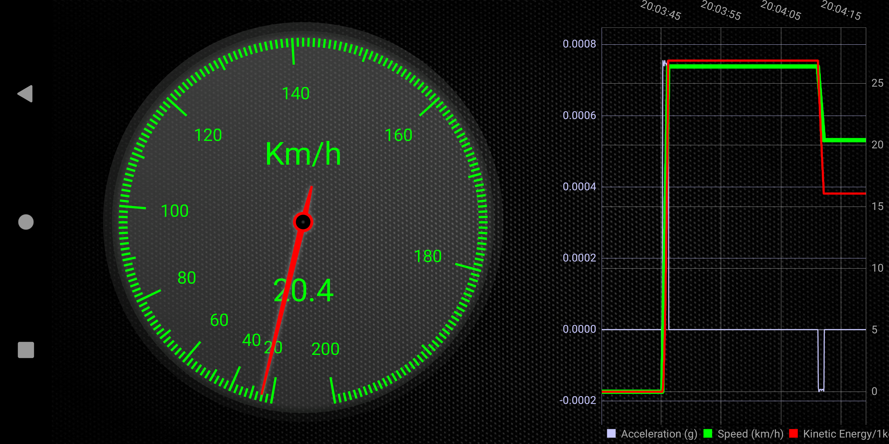
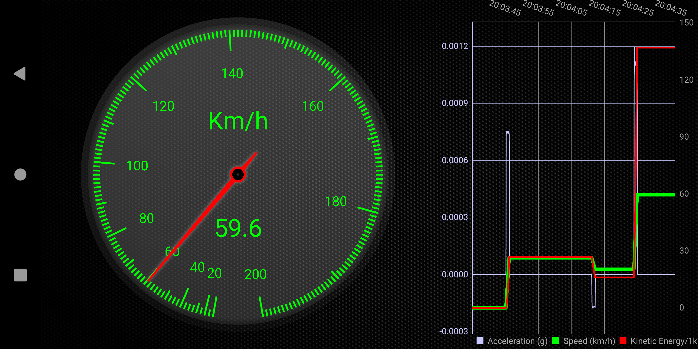

# KineticE speedometer

A GPS (for now) speedometer with a non linear gauge. The gauge nicks are set on a non linear scale that is proportional with the kinetic energy that a mass of 1kg will have at the particular spee.

